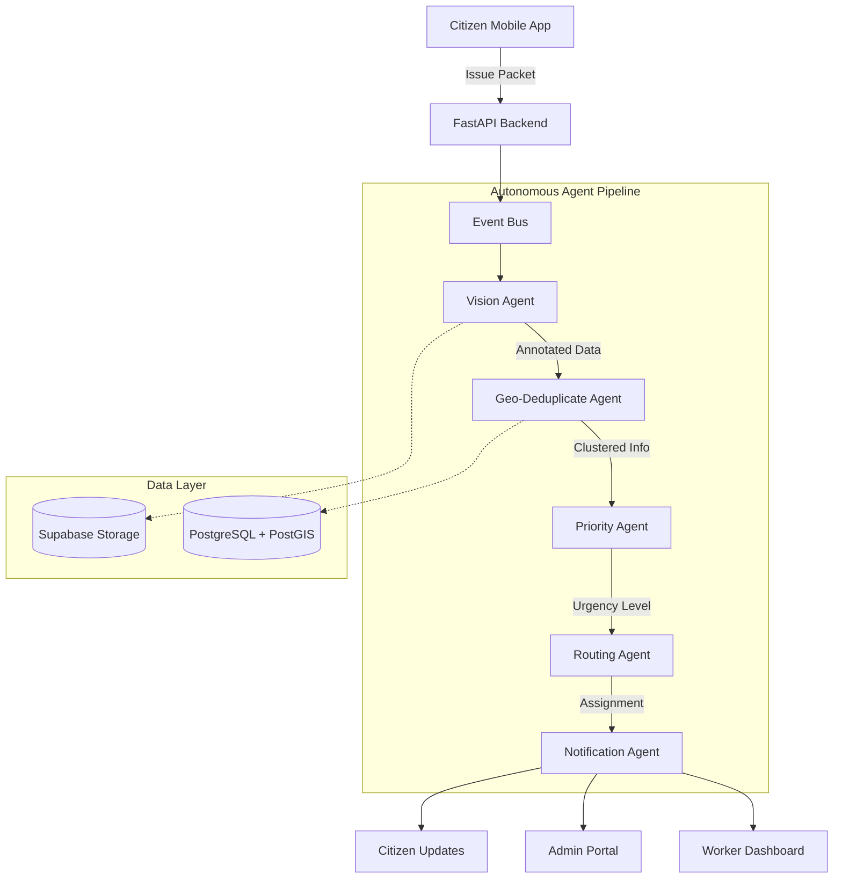

# UrbanLens

```text
  _    _      _                 _                      
 | |  | |    | |               | |                     
 | |  | |_ __| |__   __ _ _ __ | |     ___ _ __  ___   
 | |  | | '__| '_ \ / _` | '_ \| |    / _ \ '_ \/ __|  
 | |__| | |  | |_) | (_| | | | | |___|  __/ | | \__ \  
  \____/|_|  |_.__/ \__,_|_| |_|______\___|_| |_|___/ 
```

**"Governance at the Speed of Software."**

## ❏ Idea Brief
UrbanLens is an autonomous, event-driven operating system for smart cities that transforms civil infrastructure maintenance from reactive to proactive. Unlike traditional 311 systems that rely on manual triage, UrbanLens leverages AI agents to instantly detect, validate, and route urban issues-such as potholes, illegal dumping, and damaged signage-without human fatigue or bias. By using citizens as real-time sensors and autonomous agents as the nervous system, UrbanLens ensures city-scale, self-healing infrastructure.

## ❏ The Problem
Traditional urban governance is plagued by:
- **Manual Bottlenecks:** Every report sits in a queue waiting for human categorization.
- **Redundancy:** Multiple citizens report the same issue, creating duplicate tickets and wasting resources.
- **Data Black Holes:** Citizens rarely receive feedback on their reports, leading to civic frustration.
- **Subjective Prioritization:** Urgent issues on main roads are often treated the same as minor issues in quiet alleys.

## ❏ The Solution: UrbanLens
UrbanLens introduces the **"Issue Packet"**-an immutable unit of data containing visual evidence, GPS metadata, and intent. This packet triggers an autonomous chain reaction across a specialized agent pipeline.

### System Architecture


## ❏ The Autonomous Pipeline

1.  **[Vision Agent]:** Uses YOLO-based computer vision to scan images, detect defects, and filter spam.
2.  **[Geo-Temporal Deduplication Agent]:** Checks the geospatial index to merge reports of the same issue into clusters, increasing urgency based on frequency.
3.  **[Priority Agent]:** Assesses severity based on visual confidence, location (e.g., proximity to schools/hospitals), and category. Sets strict SLA deadlines.
4.  **[Routing Agent]:** Dispatches tasks to the correct department (Roads, Sanitation, etc.) and specific field workers based on load and geography.
5.  **[Notification Agent]:** Provides real-time updates to citizens and instant job alerts to field workers.

## ❏ Tech Stack

- **Backend:** FastAPI, Python, SQLAlchemy, PostgreSQL (PostGIS)
- **AI/ML:** YOLOv8s (Fine-tuned for urban defects)
- **Frontend:** Next.js (Admin/Worker Dashboards), Tailwind CSS
- **Mobile:** React Native, Expo, TypeScript
- **Infrastructure:** Supabase (Auth, Storage), Docker

## ❏ Key Features
- **Anti-Fraud Reporting:** Mandatory live camera and high-precision GPS lock to prevent fake reports.
- **Real-Time Tracking:** Server-driven progress visualization for citizens.
- **Proof of Resolution:** Workers must upload "After" photos to close tickets.
- **Heatmaps:** Data-driven insights for city administrators to identify systemic issues.

## ❏ Agent Pipeline Details

**Stage 1: Input & Validation**
- Vision Agent: Scans images, detects objects (potholes, garbage, debris), rejects spam, classifies issues.
- Geo-Temporal Deduplication Agent: Checks for duplicate issues in space/time, merges reports, increases urgency for repeated reports.

**Stage 2: Decision Making**
- Priority Agent: Assigns severity (CRITICAL, HIGH, MEDIUM, LOW) and SLA deadlines based on context.
- Routing Agent: Assigns issues to correct department and worker, optimizes resource allocation.

**Stage 3: Execution & Follow-up**
- SLA Watchdog Agent (Planned): Monitors deadlines, triggers escalation if breached.
- Escalation Agent (Planned): Handles overdue issues, reassigns to supervisors, flags for transparency.
- Notification Agent: Sends updates to citizens and workers via multiple channels.

## ❏ Data Layer
- **PostgreSQL + PostGIS:** Central database for issues, events, and clustered locations (heatmaps).
- **Supabase Storage:** Stores images and evidence securely.

---
*Built by BitBots for a smarter, more responsive city.*
