# UrbanLens

```text
  _    _      _                 _                      
 | |  | |    | |               | |                     
 | |  | |_ __| |__   __ _ _ __ | |     ___ _ __  ___   
 | |  | | '__| '_ \ / _` | '_ \| |    / _ \ '_ \/ __|  
 | |__| | |  | |_) | (_| | | | | |___|  __/ | | \__ \  
  \____/|_|  |_.__/ \__,_|_| |_|______\___|_| |_|___/ 
```

<div align="center">


</div>

**"Governance at the Speed of Software."**

## ❏ Idea Brief
UrbanLens is an autonomous, event-driven operating system for smart cities that transforms civil infrastructure maintenance from reactive to proactive. Unlike traditional 311 systems that rely on manual triage, UrbanLens leverages AI agents to instantly detect, validate, and route urban issues-such as potholes, illegal dumping, and damaged signage-without human fatigue or bias. By using citizens as real-time sensors and autonomous agents as the nervous system, UrbanLens ensures city-scale, self-healing infrastructure.

## ❏ System Internals: The "Issue Packet"
Every interaction in UrbanLens starts with an **Issue Packet**—an immutable, atomic unit of civic data.
- **Evidence:** Primary visual proof (Image/Video) captured via mandatory live camera.
- **Context:** High-precision GPS (<10m accuracy), Compass Heading, and Device Metadata.
- **Intent:** User-provided description, enhanced by NLP.

### Anti-Fraud Enforcement
UrbanLens implements a "Spot-Check" protocol to ensure data integrity at the source:
1.  **Live Camera Only:** The mobile app restricts gallery access. Users MUST capture photos live, preventing the repurposing of old or internet images.
2.  **GPS Precision Lock:** Submission is practically blocked unless GPS accuracy is better than **10 meters**.
3.  **Identity Binding:** All reports are cryptographically linked to a verified Google Identity (Supabase Auth).

## ❏ The Problem
Traditional urban governance is plagued by:
- **Manual Bottlenecks:** Every report sits in a queue waiting for human categorization.
- **Redundancy:** Multiple citizens report the same issue, creating duplicate tickets and wasting resources.
- **Data Black Holes:** Citizens rarely receive feedback on their reports, leading to civic frustration.
- **Subjective Prioritization:** Urgent issues on main roads are often treated the same as minor issues in quiet alleys.

## ❏ The Solution: UrbanLens
UrbanLens introduces the **"Issue Packet"**-an immutable unit of data containing visual evidence, GPS metadata, and intent. This packet triggers an autonomous chain reaction across a specialized agent pipeline.

### System Architecture
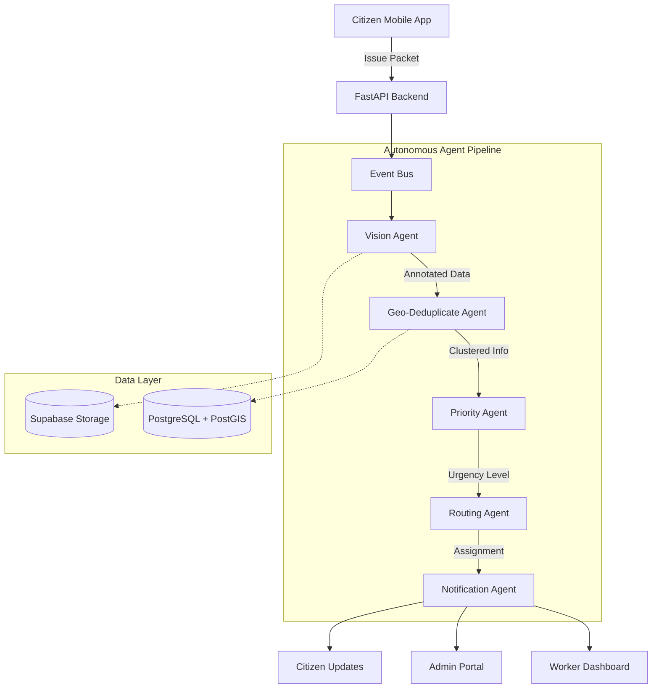

## ❏ The Autonomous Pipeline (Deep Dive)
The systems acts as a nervous system where agents react to the "Issue Packet" in real-time.

### Stage 1: The Senses (Input & Validation)
- **Vision Agent:** The "Eyes". Uses a fine-tuned **YOLOv8** model to scan incoming images.
    - **Rejection:** Automatically discards irrelevant images (e.g., selfies, blurry photos).
    - **Classification:** Identifies defects (Pothole, Debris, Graffiti) with confidence scores.
- **Geo-Temporal Deduplication Agent:** The "Memory".
    - **Clustering:** Queries the geospatial index for similar reports within `X` meters and `Y` hours.
    - **Merging:** Instead of creating duplicates, it merges reports into a single "Cluster", increasing its urgency score.

### Stage 2: The Brain (Decision Making)
- **Priority Agent:** The "Judge".
    - **Context Awareness:** Combines Vision Confidence + Location Context (e.g., "Near School") + Repeat Count.
    - **SLA Setting:** Assigns dynamic deadlines (e.g., 4 hours for Critical).
- **Routing Agent:** The "Dispatcher".
    - **Logic:** Matches issue category to Department (Roads vs Sanitation) and assigns to specific workers based on geolocation and load.

### Stage 3: The Enforcers (Execution)
- **SLA Watchdog Agent:** The "Timekeeper".
    - **AI Monitoring:** analyze the *context* of delayed issues, not just the timer.
    - **Escalation:** Triggers warnings at 50% and 20% remaining time.
- **Notification Agent:** The "Messenger".
    - **Omnichannel:** Pushes updates to the Citizen (App) and Worker (Task List) simultaneously and send email notifications to respectives.

## ❏ Project Showcase

<details>
<summary><b>User Mobile App Interface</b></summary>
<br>
<div align="center">
  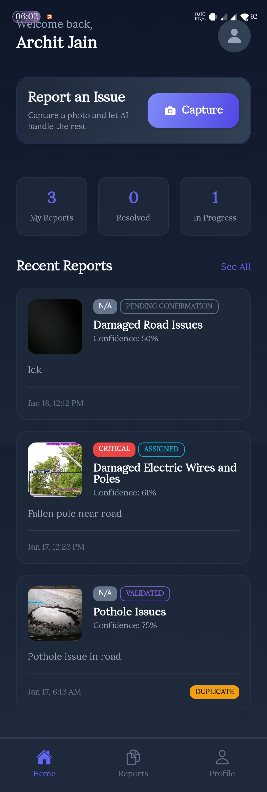 &nbsp;
  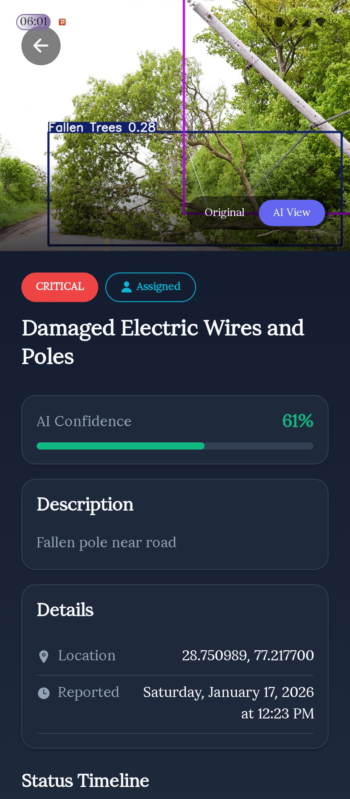
</div>
</details>

<details>
<summary><b>Admin Command Center</b></summary>
<br>
<div align="center">
<table>
  <tr>
    <td align="center">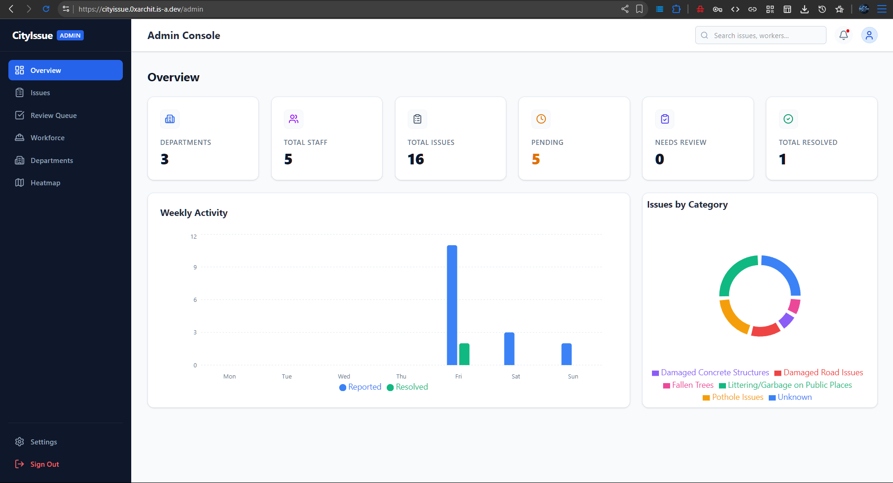<br><b>Admin Dashboard</b></td>
    <td align="center">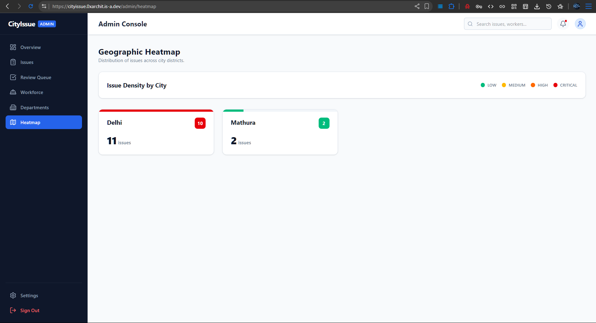<br><b>Geospatial Heatmap</b></td>
  </tr>
  <tr>
    <td align="center">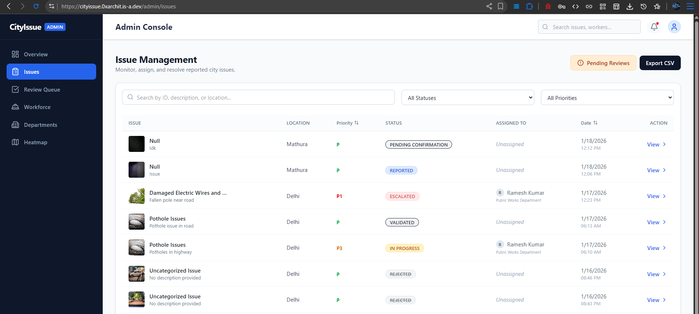<br><b>Issue Management</b></td>
    <td align="center">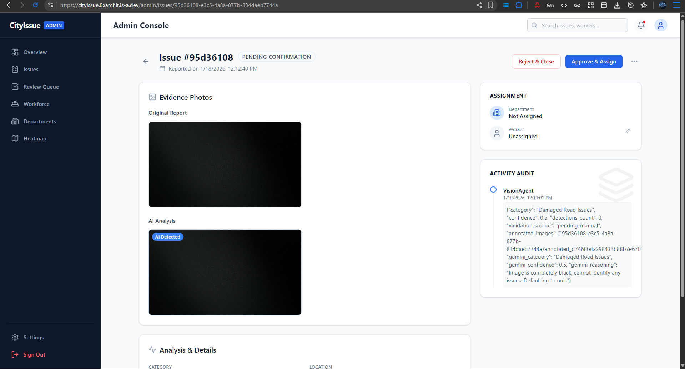<br><b>AI Manual Review</b></td>
  </tr>
  <tr>
    <td align="center">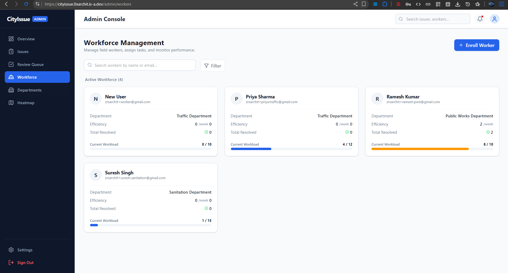<br><b>Workforce Management</b></td>
    <td align="center">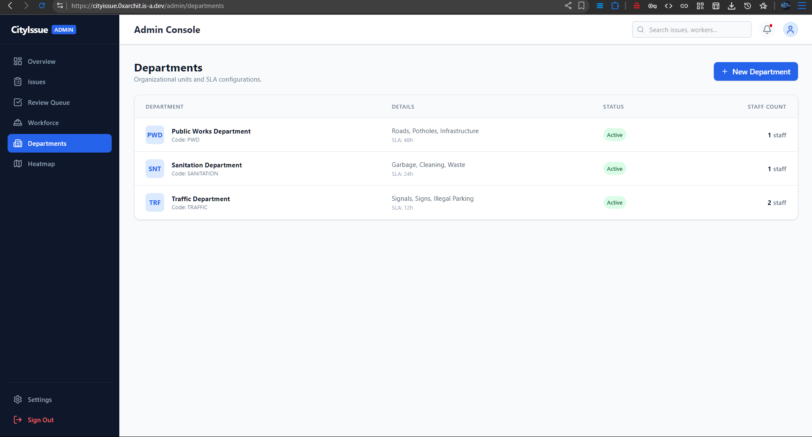<br><b>Department Control</b></td>
  </tr>
  <tr>
     <td align="center" colspan="2">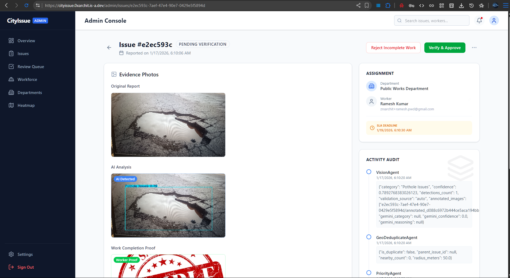<br><b>Worker Requests</b></td>
  </tr>
</table>
</div>
</details>

<details>
<summary><b>Worker & Resolution Portal</b></summary>
<br>
<div align="center">
<table>
  <tr>
      <td align="center">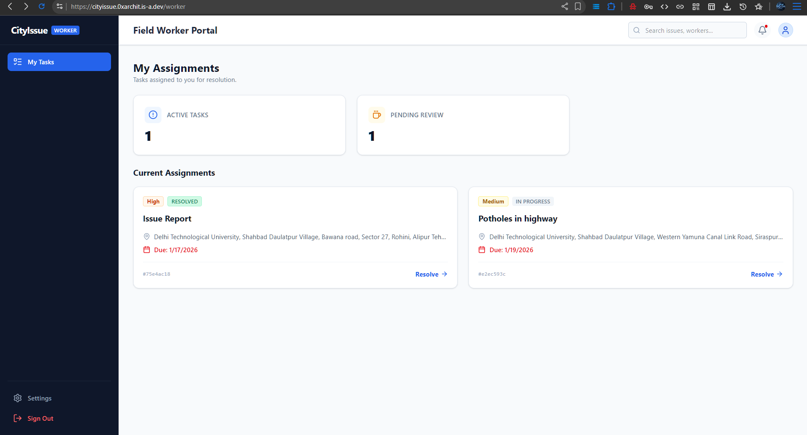<br><b>Worker Dashboard</b></td>
      <td align="center">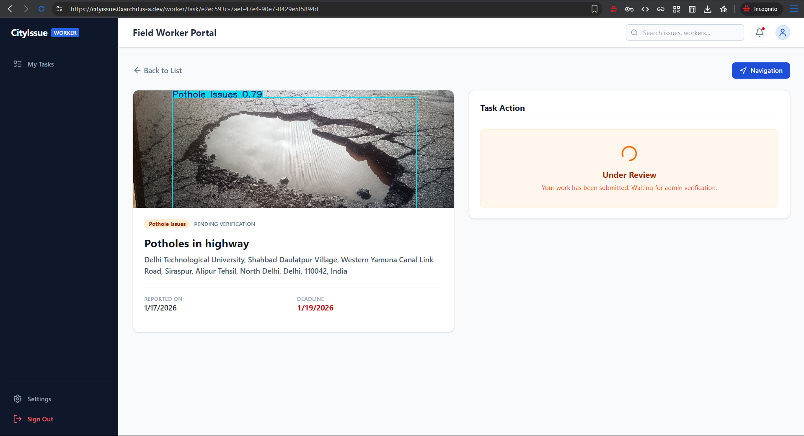<br><b>Resolution Protocol</b></td>
  </tr>
    <tr>
      <td align="center">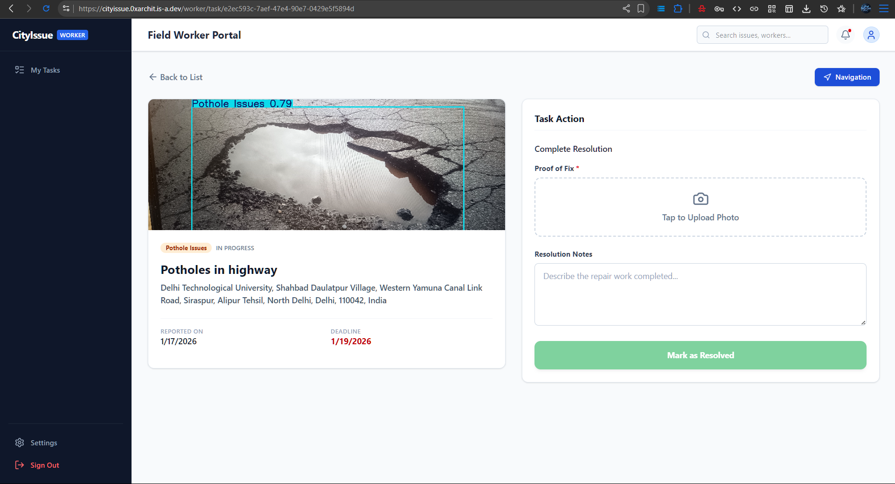<br><b>Evidence Submission</b></td>
      <td align="center">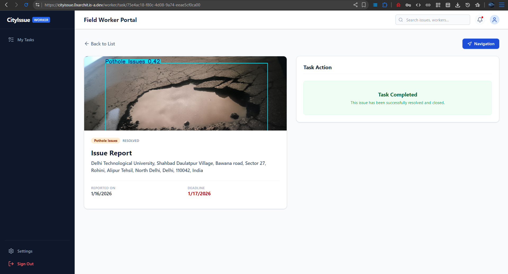<br><b>Task Completion</b></td>
  </tr>
</table>
</div>
</details>

<details>
<summary><b>Web Portal for Citizen</b></summary>
<br>
<div align="center">
  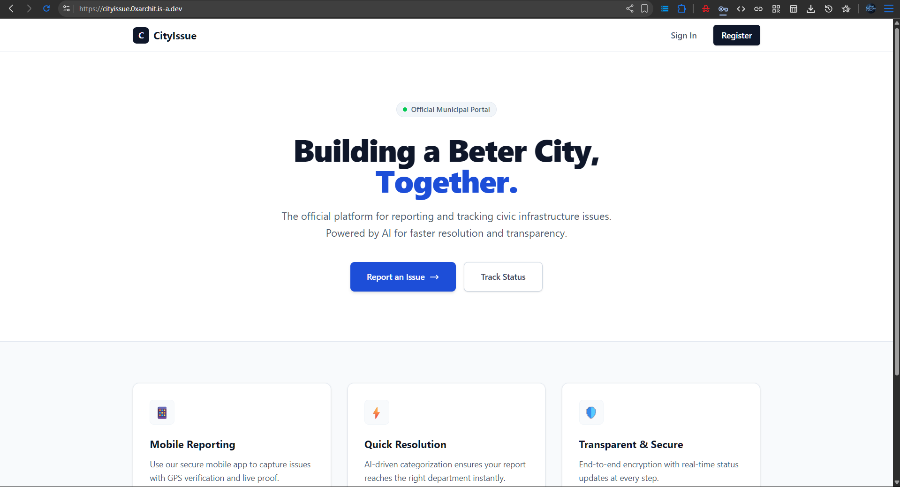
  <br><br>
  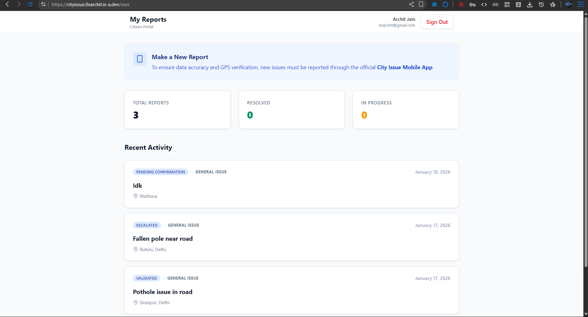
</div>
</details>

<details>
<summary><b>Autonomous Pipeline</b></summary>
<br>
<div align="center">
  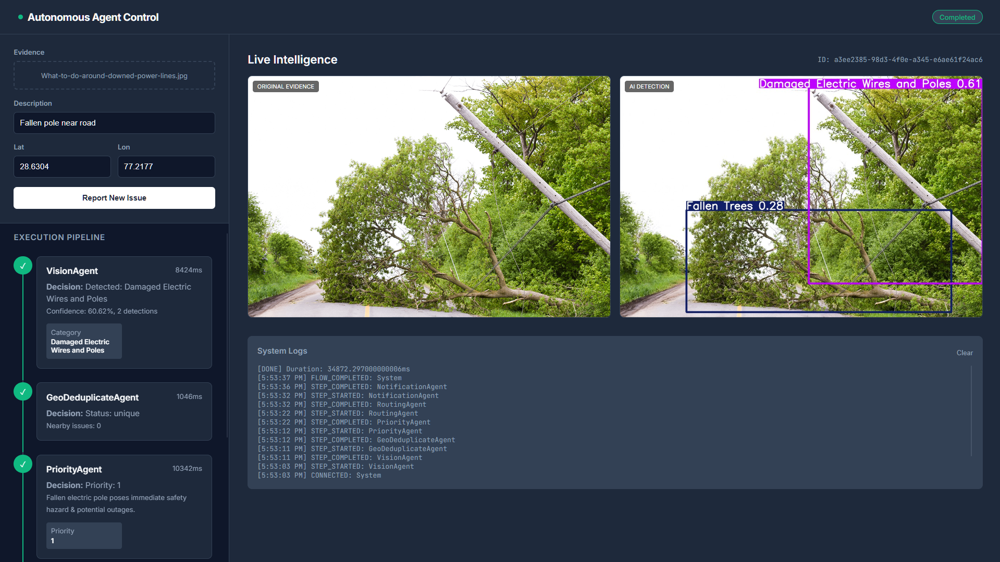
</div>
</details>

## Client Ecosystem

### 1. Citizen Mobile App (The Sensors)
*Built with React Native + Expo (TypeScript)*
- **Offline-First:** (Experimental Beta) Caches reports locally and syncs when connection returns.
- **Real-Time Tracking:** Server-driven events update the "Processing" screen live as agents complete their tasks.
- **Gamification:** (Planned) Civic points for verified reports.

### 2. Admin Command Center (The Control)
*Built with Next.js 16 (App Router) + Tailwind CSS*
- **Role-Based Access Control (RBAC):**
    - **Super Admin:** System config.
    - **Worker Dashboard:** Submission of issues and resolution.
- **Visual Intelligence:** Heatmaps and density plots to identify crumbling infrastructure zones.

### 3. Worker Interface (The Hands)
*Mobile-First Web View*
- **Task List:** Simple, priority-sorted list of jobs.
- **Navigation:** One-tap deep link to Google Maps.
- **Proof of Resolution:** Workers **cannot close a ticket** without uploading a photo. The Vision Agent verifies this photo against the original to confirm the fix.

## ❏ Modular Monolith Architecture

The codebase is structured to scale from a Monolith to Microservices easily.

```text
/
├── Backend/              # The Core Logic (FastAPI + Async SQLAlchemy)
│   ├── agents/           # 🧠 The Brain: 7 Autonomous Agents (Vision, Geo, SLA, Priority, Routing, Notification, Escalation)
│   ├── api/              # Stateless REST Endpoints (Routes)
│   ├── core/             # Shared Infra (Event Bus, Config)
│   └── orchestration/    # Agent Base Classes & Workflow Managers
│   └── Database/         # Database Models & Schemas
│   └── services/         # Services (Email, Authentication, etc)
├── User/                 # 📱 Citizen Mobile App (Expo/React Native)
├── Frontend/             # 💻 Admin & Worker Portals (Next.js 16)
├── infra/                # ☁️ Docker & Deployment Config
└── assets/               # Project Screenshots & Media
```

## ❏ Tech Stack

- **Backend:** FastAPI, Python, SQLAlchemy, PostgreSQL (PostGIS)
- **AI/ML:** YOLOv8s (Fine-tuned for urban defects)
- **Frontend:** Next.js (User/Admin/Worker Web Dashboards), Tailwind CSS
- **Mobile:** React Native, Expo, TypeScript
- **Infrastructure:** Supabase (Auth, Storage), Docker

## ❏ Key Features
- **Anti-Fraud Reporting:** Mandatory live camera and high-precision GPS lock to prevent fake reports.
- **Real-Time Tracking:** Server-driven progress visualization for citizens.
- **Proof of Resolution:** Workers must upload "After" photos to close tickets.
- **Heatmaps:** Data-driven insights for city administrators to identify systemic issues.

## ❏ Agent Pipeline Details

**Stage 1: Input & Validation**
- **Vision Agent:** Scans images, detects objects (potholes, garbage, debris), rejects spam, classifies issues.
- **Geo-Temporal Deduplication Agent:** Checks for duplicate issues in space/time, merges reports, increases urgency for repeated reports.

**Stage 2: Decision Making**
- **Priority Agent:** Assigns severity (CRITICAL, HIGH, MEDIUM, LOW) and SLA deadlines based on context.
- **Routing Agent:** Assigns issues to correct department and worker, optimizes resource allocation.

**Stage 3: Execution & Follow-up**
- **SLA Watchdog Agent:** Monitors deadlines, triggers escalation if breached.
- **Escalation Agent:** Handles overdue issues, reassigns to supervisors, flags for transparency.
- **Notification Agent:** Sends updates to citizens and workers via multiple channels.

## ❏ Roadmap & Future Vision

### Phase 1: The Foundation (Completed)
- Autonomous Agent Pipeline (Vision, Geo, Priority, Routing, etc).
- Cross-Platform Ecosystem (Citizen App, Admin Portal, Worker View).

### Phase 2: Predictive Governance
- **Predictive Maintenance:** Using historical data to predict potholes before they form (e.g., "Road X cracks every March").
- **IoT Fusion:** Integrating direct feeds from smart bins and streetlights.

### Phase 3: Gamification
- **Civic Reputation:** Leaderboards for top contributing citizens.
- **Incentives:** Tax credits or transit passes for verified infrastructure reporting.

---
*Built by BitBots for a smarter, more responsive city.*
